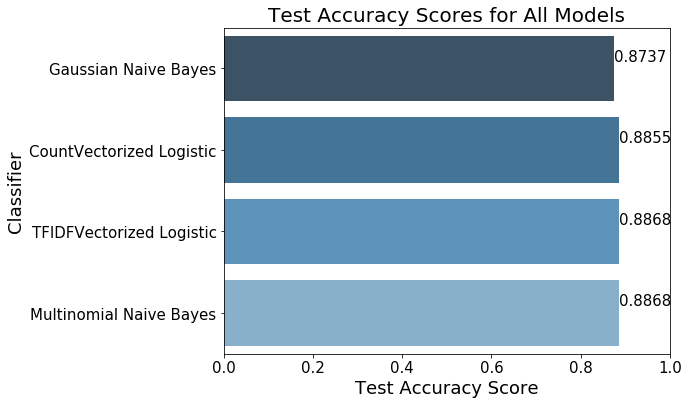

# Classifying-subreddit-cars-vs-teslamotors-with-NLP
### By Alex Lau

## Contents:
- [Problem Statement](#Problem-Statement)
- [Executive Summary](#Executive-Summary)
- [Conclusions and Recommendations](#Conclusions-and-Recommendations)
- [Data Dictionary](#Data-Dictionary)

---

## Problem Statement

Automobiles have progressed slowly over the last century. Most cars on the road today are still powered by gasoline, a non-renewable resource that pollutes the air and contributes to global warming. There is one manufacturer that is revolutionizing transportation with electric vehicles: Tesla Motors. We have decided to investigate subreddit titles from a popular American social news website, Reddit, to better understand the public sentiments surrounding Tesla. Our goal is to learn the text of subreddit titles and correctly classify them as originating from subreddit 'cars' or 'teslamotors'. We plan to solve this problem using Logistic Regression and Multinomial Naive Bayes Classifier. Our models will be evaluated using Accuracy Scores of the test data. As Data Scientists of the 21st century, it is important we identify what differentiates the public opinion of an innovative brand and leverage this to influence the remaining population to transition to clean energy sources.

---

## Executive Summary

We begin our webscraping by utilizing pushshift.io API to download the most recent 150 days of content from our two subreddit topics. To prevent overloading the Reddit server, we broke this up into 30 day steps, with a maximum of 500 posts each iteration and a 2 second delay between each. This supplied us with roughly 3,000 posts, roughly 55/45 split between 'cars' and 'teslamotors. Ideally we would like a 50/50 split, but this was still relatively balanced, so we proceeded to combine and store both datasets into a single dataframe. During an initial view of top words from each subreddits, we realized that the single words provided very little context to distinguish between the subreddits. We then focused our scope on most frequent bigrams and quickly identified key differences. Subreddit 'cars' contained mostly combinations or descriptions of the word car, such as 'new car' which was more frequent than 'old car'. We also saw makes and models of popular cars. Subreddit 'teslamotors', on the other hand, contained many terms pertaining to software, such as 'feature request', 'smart summon, 'sentry mode', all of which are capabilities beyond the competition. Another interesting observation in this classification was that the bigram 'used car' was more frequent than 'new car'. This phenomenon can be explained by the fact that Tesla continues to improve existing vehicles over time with over the air (OTA) software updates. Upon this initial exploratory data analysis, we were confident in our ability to build a model that could distinguish between the two subreddits.

In our data cleaning process, we removed any potential duplicates that may have resulted during our webscrapping, as overlaps were possible due to our fragmented webscrapping strategy. We also needed needed to consider the reddit-specific terms that ended up in titles, such as 'daily discussion' and 'support thread'. We set them up as stop words in our models, in addition to the NTLK's list of English stop words. To normalize the text with the titles, we setup Porter Stemmer and Word Net Lemma tokenizer classes, which serve to reduce variation of words to their base form. Stemming is a more aggresive approach that may result in words that are NOT true words of the English language, however, lemmatizing considers parts of speech before normalizing into base forms of true English words.

We built pipelines of transformers and models and added a GridSearch to idenfity the optimal hyper-parameters for the following models to achieve highest Accuracy scores:
1. **Count Vectorized Logistic Regression** - Count Vectorizer is a transformer that tokenizes text by lowercasing and removing punctuation from words and then groups the words and counts the frequency within each document. Logistic Regression uses a logistic function to model our binary classification problem.  
2. **TF-IDF Vectorized Logistic Regression** - Term Frequency Inverse Document Frequency tokenizes by applying increased weights on tokens that are frequent within a document, but offsets this with decreasing weights for tokens that are frequent within the corpus. 
3. **Multinomial Naive Bayes Classifier** - Mutlinomial Naive Bayes calculates the classification likelihood based on the count of a word or token, and therefore we have included a Count Vectorizer. 
4. **Gaussian Naive Bayes Classifier** - Gaussian Naive Bayes is used in cases where our features are continuous, hence we will combine this with our TF-IDF Vectorizer. A Gaussian distributions is also called a normal distribtuion, providing a bell shaped curve symmetric about the mean of the feature values.

To decide which model we should settle for, we computed three different scores for each scenario:

* **Mean Cross Validation Score across 5-folds**, which we use as an indicator for how consistent our model predictions are.
* **Accuracy** score for the *training* set
* **Accuracy** score for the *testing* set

We then tested our models and evaluated them based on these three metrics.

The scores for all scenarios are shown below:

* We find **Count Vectorized Logistic Regression** model does better than the other models in each of their corresponding cross-validation, train, and test cases.

With this evidence, our production model was selected to be the Count Vectorized Logistic Regression model.

---

## Conclusions and Recommendations

All of our models were more successful than the baseline in classifying the subreddit from both training and testing set, but our Count Vectorized Logistic Model outperformed the rest with a testing accuracy score of 87.5%. 

There are a number of limitations that the model suffers from however:

1. The model suffers from slight overfitting as the Accuracy of the Testing Set is 8.71% points lower than the Training Set's 
2. Its predictive power is limited by the time frame of reddit posts. Our webscrape pulls the most recent 150 days of content, which is continuously changing, but our model represents a snapshot in time.

We are successful in building a model that can reasonably classify a title of a reddit post to belonging to subreddit 'teslamotors' or 'cars'. We were also successfull in identifying key words beyond the make and model that hold significance, such as autopilot, v10, and summon. Tesla spends $0 on advertising, so it is not surprising if the population is not familiar with these features in relation to vehicles. If we can educate the public on new technologies that exist on Tesla vehicles, specifically context behind the highest non-make and model coefficients of our model from subreddit 'teslamotors', we can potentially reduce the dependency on gas, slow down global warming and pollution, and save some lives with autopilot.

---

## Data Dictionary ##

1. https://pushshift.io/api-parameters/
